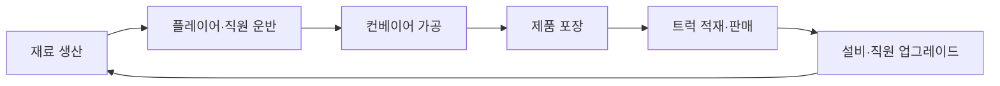
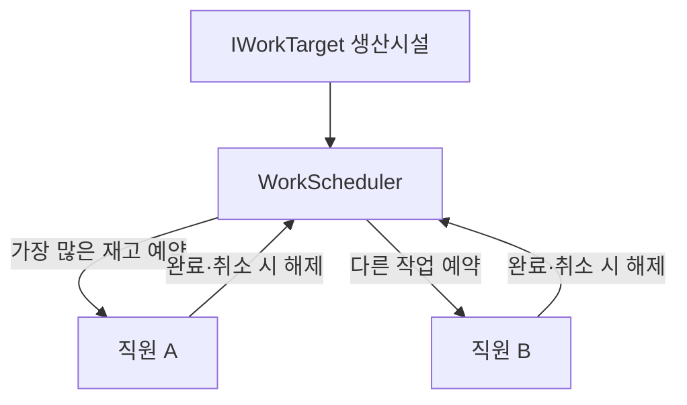

# 고양이가 츄르룹

<p align="center">
  
</p>

고양이 직원들과 츄르 공장을 운영하는 모바일 캐주얼 경영 게임입니다. 재료 생산부터 운반, 가공, 포장, 판매까지 이어지는 공장 자동화 루프를 구현하고 Android에 출시했습니다.

- 엔진: Unity 2021.3.32f1
- 플랫폼: Android 7.0 이상
- 출시 버전: 1.0.1
- 리팩터링 버전: 1.1.0
- 배포 기록: [APKPure에서 확인](https://apkpure.net/%EA%B3%A0%EC%96%91%EC%9D%B4%EA%B0%80-%EC%B8%84%EB%A5%B4%EB%A3%B9/com.Churub.ChurubFactory)

> `v1.1.0` 브랜치는 출시 버전의 동작과 저장 스키마를 유지하면서 코드 구조, 테스트 가능성, 저장소 보안을 개선하는 포트폴리오 리팩터링입니다.

## 게임 흐름



## 주요 구현

- 조이스틱 기반 캐릭터 이동과 카메라 기준 방향 보정
- NavMesh를 사용하는 직원 자동 운반
- 생산시설 재고를 기준으로 한 작업 예약과 중복 할당 방지
- 재료 생성·가공·포장·판매로 이어지는 생산 파이프라인
- 오브젝트 풀링과 DOTween 기반 적재 연출
- 서버 저장·불러오기와 기존 데이터 스키마 호환
- Google Play 로그인, 리더보드, 업적
- 전면·보상형 광고와 인게임 버프
- 튜토리얼, 시설 해금, 업그레이드 시스템
- 인앱 업데이트, 진동, 옵션, 오디오 관리

## 리팩터링 핵심

기존 직원 AI는 각 직원이 전체 생산시설을 반복 탐색하고 코루틴을 중복 실행할 수 있었습니다. `v1.1.0`에서는 선택 규칙을 Unity에 의존하지 않는 `WorkScheduler`로 분리했습니다.



개선 결과:

- 같은 작업을 여러 직원에게 할당하던 경쟁 조건 제거
- 실행 중인 Enumerator를 찾지 못하던 `StopCoroutine(CheckStack())` 제거
- 직원마다 하나의 작업 확인 코루틴만 유지
- 항상 참이던 `Count >= 0` 이동 조건 수정
- 작업 선택 규칙을 EditMode에서 독립적으로 테스트
- 서버 데이터 생성 실패 시 무한 재귀 대신 최대 3회 재시도

자세한 내용은 [아키텍처](docs/ARCHITECTURE.md)와 [리팩터링 기록](docs/REFACTORING.md)을 참고하세요.

## 프로젝트 구조

```text
Assets/
├─ 1. Scripts/
│  ├─ AI/          직원·NPC 행동
│  ├─ Core/        Unity 비의존 핵심 로직
│  ├─ Guide/       튜토리얼·해금
│  ├─ Player/      플레이어 조작·인벤토리
│  ├─ System/      저장·UI·오디오·게임 흐름
│  └─ Work/        생산·가공·포장·판매 시설
├─ 2. Scene/       Title, Game
├─ 3. Prefab/      캐릭터·시설·UI
└─ Tests/EditMode/ 핵심 로직 테스트
```

번호가 포함된 기존 에셋 경로는 Unity 참조 안정성을 위해 1.1.0에서 유지하고, 신규 코드는 역할 중심 디렉터리에 배치합니다.

## 실행

1. Unity Hub에서 `2021.3.32f1`과 Android Build Support를 설치합니다.
2. 이 저장소를 Unity 프로젝트로 추가합니다.
3. 빌드 타깃을 Android로 전환합니다.
4. `Assets/2. Scene/Title.unity`를 열고 Play를 누릅니다.

Google Play 및 백엔드 기능은 각 서비스의 개발자 설정과 인증 정보가 필요합니다. Android 서명 키는 보안을 위해 저장소에 포함하지 않습니다.

## 검증

```powershell
& 'C:\Program Files\Unity\Hub\Editor\2021.3.32f1\Editor\Unity.exe' `
  -batchmode -nographics -runTests -testPlatform editmode `
  -buildTarget Android -projectPath . `
  -testResults Logs\EditModeResults.xml -logFile Logs\EditModeTests.log
```

현재 `WorkScheduler` EditMode 테스트 4개가 있으며 다음 동작을 검증합니다.

- 가장 많은 재고를 가진 작업 선택
- 동일 작업의 중복 예약 방지
- 예약 해제 후 재할당
- 재고가 없는 작업 제외

개발용 Android APK는 다음 명령으로 재현할 수 있습니다.

```powershell
& 'C:\Program Files\Unity\Hub\Editor\2021.3.32f1\Editor\Unity.exe' `
  -batchmode -quit -buildTarget Android -projectPath . `
  -executeMethod PortfolioBuild.BuildAndroidDevelopment `
  -logFile Logs\AndroidBuild.log
```

출력 파일은 `Build/Android/Churub-v1.1.0.apk`이며 저장소에는 포함하지 않습니다.

## 알려진 제한

- 출시 당시 서비스 SDK를 보존하고 있어 최신 API로의 마이그레이션이 필요합니다.
- 기존 저장 데이터 호환을 위해 문자열 키 기반 백엔드 스키마를 유지합니다.
- 자동화 테스트는 현재 작업 할당 핵심 로직부터 단계적으로 확장 중입니다.
- 상용 또는 외부 에셋은 각 라이선스에 따라 별도로 준비해야 할 수 있습니다.
