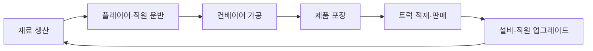
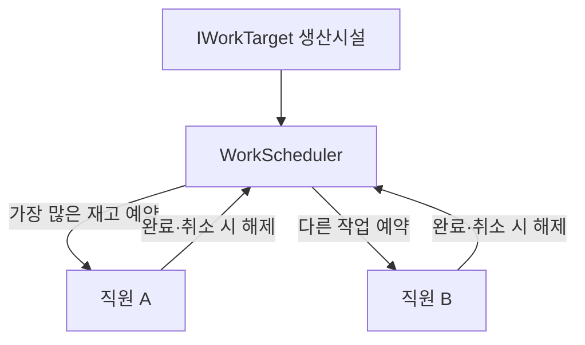

# 고양이가 츄르룹

<p align="center">
  
</p>

고양이 직원들과 츄르 공장을 운영하는 모바일 캐주얼 경영 게임입니다. 재료 생산부터 운반, 가공, 포장, 판매까지 이어지는 공장 자동화 루프를 구현하고 Android에 출시했습니다.

- 엔진: Unity 6000.3.23f1 (Unity 6.3 LTS)
- 렌더링: Built-in Render Pipeline
- 플랫폼: Android API 25 이상, Target API 36
- 출시 버전: 1.0.1
- 현재 프로젝트 버전: 1.1.0
- 배포 기록: [APKPure에서 확인](https://apkpure.net/%EA%B3%A0%EC%96%91%EC%9D%B4%EA%B0%80-%EC%B8%84%EB%A5%B4%EB%A3%B9/com.Churub.ChurubFactory)

> 이 README는 `upgrade/unity-engine` 통합 브랜치 기준입니다. Unity 6.3 전환에 더해 밸런스, 백엔드 시작·저장 흐름, 아이템 운반 구조를 개선하고 있습니다. 앱 버전은 `1.1.0`이며, 현재 변경 전체가 새 출시 버전으로 검증된 것은 아닙니다.

## 현재 개발 상태

- `main`: 기존 기준 버전
- `upgrade/unity-engine`: 변경을 모아 검증하는 통합 브랜치
- [통합 PR #4](https://github.com/yj9809/churub-factory/pull/4): Unity 검증 전 Draft 상태로 관리

이전 `v1.1.0`·`refactor/game-data-state` 브랜치는 main에 병합됐고, CI 작업도 통합 브랜치에 반영됐습니다. 해당 작업 브랜치는 정리했으며 `v1.1.0` 태그는 유지합니다. 통합 변경은 테스트·플레이·Android 빌드 검증 후 main에 반영할 예정입니다.

## 게임 흐름



## 주요 구현

- 조이스틱 기반 캐릭터 이동과 카메라 기준 방향 보정
- NavMesh를 사용하는 직원 자동 운반
- 생산시설 재고를 기준으로 한 작업 예약과 중복 할당 방지
- 재료 생성·가공·포장·판매로 이어지는 생산 파이프라인
- 오브젝트 풀링과 DOTween 기반 적재 연출
- 서버 저장·불러오기와 기존 데이터 스키마 호환
- Google Play 로그인, 리더보드, 업적
- 전면·보상형 광고와 인게임 버프
- 튜토리얼, 시설 해금, 업그레이드 시스템
- 인앱 업데이트, 진동, 옵션, 오디오 관리

## 리팩터링 핵심

### 기존 기준 버전: 직원 작업 할당과 상태 분리

기존 직원 AI는 각 직원이 전체 생산시설을 반복 탐색하고 코루틴을 중복 실행할 수 있었습니다. `v1.1.0`에서는 선택 규칙을 Unity에 의존하지 않는 `WorkScheduler`로 분리했습니다.



`v1.1.0` 기준 개선 결과:

- 같은 작업을 여러 직원에게 할당하던 경쟁 조건 제거
- 실행 중인 Enumerator를 찾지 못하던 `StopCoroutine(CheckStack())` 제거
- 직원마다 하나의 작업 확인 코루틴만 유지
- 항상 참이던 `Count >= 0` 이동 조건 수정
- 작업 선택 규칙을 EditMode에서 독립적으로 테스트
- 서버 데이터 생성 실패 시 무한 재귀 대신 최대 3회 재시도
- 업그레이드 계산을 `UpgradeService`로, 직원 생성·등록을 `EmployeeFactory`로 분리

자세한 내용은 [아키텍처](docs/ARCHITECTURE.md)와 [리팩터링 기록](docs/REFACTORING.md)을 참고하세요.

### 아이템 운반과 작업 영역

기존에는 Player와 Employee가 아이템 종류별 스택을 가지고, WorkPoint가 enum과 switch로 설비별 동작을 직접 선택했습니다. 현재는 아이템 식별, 보관 규칙, 상호작용 감지, 작업 실행을 분리했습니다.

| 구성 요소 | 책임 |
| --- | --- |
| `Item` | 자신의 ItemType과 실행 중 보관 주체 식별 |
| `ItemBuffer` / `CarrierInventory` | 한 종류 보관, 용량 제한, 중복 보관 방지와 이동 시 소유권 변경 |
| `WorkPoint` | 작업 영역 진입·유지·이탈 감지와 연결된 WorkAction 호출 |
| `WorkAction` | 아이템 전달, 포장, 상점, 업그레이드 상호작용 |
| 생산·보관 설비 | 허용 타입, 전달 방향, 가공 조건과 저장 데이터 처리 |

WorkPoint는 구체적인 ItemType이나 설비별 처리 방법을 알지 않습니다. 공통 전달은 `ItemTransfer`로 처리하고, 5개 누적과 완료 애니메이션이 있는 포장은 별도로 유지합니다. 기존 직원 역할·작업 예약과 운반 용량 제한도 유지합니다.

구현과 Scene·Prefab 연결 변경은 완료했으며, Unity 실행 검증은 남아 있습니다. 책임과 검증 항목은 [아이템 리팩터링 기록](docs/ITEM_REFACTORING.md)에 정리했습니다.

### 백엔드와 초반 진행

시작·저장 파이프라인을 분리하고, 콜백 유실 복구, 손상된 로컬 저장 격리, 리비전 기반 서버 조정을 추가했습니다. 첫 직원 지급과 시설 해금 순서도 개선했습니다. 상세 내용은 [백엔드 리팩터링](docs/BACKEND_REFACTOR.md)과 [밸런스 표](docs/BALANCE_TABLE.md)를 참고하세요.

## Unity 6 엔진 마이그레이션

Unity `2021.3.32f1` 기준 프로젝트를 `2022.3.62f1`, `6000.0.82f1` 순서로 검증한 뒤 `6000.3.23f1`로 전환했습니다.

- Built-in Render Pipeline 유지, URP 전환 미실행
- Application Identifier `com.Churub.ChurubFactory` 유지
- 앱 버전 `1.1.0`, Android version code 73 유지
- 세이브 키와 직렬화 구조 유지
- 엔진 마이그레이션 당시 에셋 GUID 변경 0개, 씬·프리팹 변경 0개 (후속 아이템 리팩터링에서는 씬·프리팹 연결 변경)
- 엔진 마이그레이션 당시 EditMode 테스트 19개 통과, 컴파일 오류 0개
- Android Development APK 및 서명 없는 Release validation AAB 생성·정적 검증
- Android API 36, IL2CPP, ARMv7·ARM64 설정
- Unity 6.3의 최소 지원 범위에 따라 Minimum API를 24에서 25로 변경

엔진 전환은 완료됐습니다. 마지막 Gradle 템플릿 보정 후 Clean AAB 재빌드, 운영 서명, 실제 기기의 세이브·핵심 플레이·Google Play·광고·BackEnd 검증은 출시 준비 단계에서 수행합니다. 실행하지 않은 항목은 통과로 간주하지 않습니다.

단계별 결과, 패키지 버전, Android 설정, 검증 결과와 롤백 방법은 [Unity 6 마이그레이션 보고서](docs/UNITY_6_MIGRATION_REPORT.md)에 기록되어 있습니다.

위 결과는 엔진 전환 시점의 기록입니다. 이후 백엔드·밸런스·아이템 변경까지 포함한 현재 통합 버전의 검증 결과를 뜻하지 않습니다.

## 프로젝트 구조

```text
Assets/
├─ 1. Scripts/
│  ├─ AI/          직원·NPC 행동
│  ├─ Core/        Unity 비의존 핵심 로직
│  ├─ Guide/       튜토리얼·해금
│  ├─ Items/       아이템 타입·보관·운반 규칙
│  ├─ Player/      플레이어 조작·인벤토리
│  ├─ System/      저장·UI·오디오·게임 흐름
│  └─ Work/        생산시설·WorkPoint·작업 컴포넌트
├─ 2. Scene/       Title, Game
├─ 3. Prefab/      캐릭터·시설·UI
└─ Tests/          핵심 로직 및 아이템 테스트
```

번호가 포함된 기존 에셋 경로는 Unity 참조 안정성을 위해 1.1.0에서 유지하고, 신규 코드는 역할 중심 디렉터리에 배치합니다.

## 실행

1. Unity Hub에서 `6000.3.23f1`과 Android Build Support, SDK, NDK, OpenJDK 모듈을 설치합니다.
2. 이 저장소를 Unity 프로젝트로 추가합니다.
3. 빌드 타깃을 Android로 전환합니다.
4. `Assets/2. Scene/Title.unity`를 열고 Play를 누릅니다.

정확한 Editor 버전은 `ProjectSettings/ProjectVersion.txt`를 기준으로 합니다. 동일한 버전으로 열어 패키지와 프로젝트 설정이 의도치 않게 변환되는 것을 방지합니다.

Google Play 및 백엔드 기능은 각 서비스의 개발자 설정과 인증 정보가 필요합니다. Android 서명 키는 보안을 위해 저장소에 포함하지 않습니다.

## 검증

프로젝트를 열고 있는 Unity Editor를 닫은 뒤, 프로젝트 루트에서 아래 명령으로 Edit Mode 테스트 실행과 결과 판정을 자동화합니다. 해당 Editor 버전과 실행 계정에서 사용할 수 있는 Unity 라이선스가 필요합니다.

```powershell
powershell -NoProfile -ExecutionPolicy Bypass -File .\Tests\RunUnityTests.ps1
```

Editor 경로 지정, 테스트 필터, 결과 파일과 CI 사용법은 [테스트 실행 안내](Tests/README.md)를 참고하세요. 아래는 Editor 직접 실행 방식입니다.

```powershell
$unityEditor = 'C:\path\to\6000.3.23f1\Editor\Unity.exe'

& $unityEditor `
  -batchmode -nographics -runTests -testPlatform editmode `
  -buildTarget Android -projectPath . `
  -testResults Logs\EditModeResults.xml -logFile Logs\EditModeTests.log
```

Core EditMode 테스트는 다음 동작을 다룹니다. 테스트 소스 존재와 실제 실행 통과는 구분하며, 실행 결과는 해당 커밋의 테스트 보고서를 기준으로 합니다.

- 가장 많은 재고를 가진 작업 선택
- 동일 작업의 중복 예약 방지
- 예약 해제 후 재할당
- 재고가 없는 작업 제외
- 출시 버전의 게임 데이터 기본값 유지
- 타입 속성과 기존 Dictionary 키의 양방향 호환
- 시설 해금 상태의 기존 저장 스키마 유지
- 백엔드 테이블과 필드 이름 유지
- 6종 업그레이드의 골드 차감, 단계, 다음 비용, 능력치 계산
- 골드 부족·최대 단계·잘못된 입력에서 상태가 변경되지 않는지 확인
- 직원 세 번째 구매의 포장 담당 생성 요청
- 직원 역할에 맞지 않는 작업을 예약하지 않는지 확인

아이템 테스트 16개는 타입 혼합·용량·중복 보관·소유권 이전·실패 시 상태 보존을 다룹니다. 현재 별도 C# 컴파일과 테스트 소스 컴파일은 통과했지만, 이 16개 테스트의 Unity 실행은 아직 완료하지 않았습니다.

WorkPoint 연결은 `python Tests/ValidateWorkPoints.py`로 정적 검사할 수 있습니다. 현재 Game Scene의 유효 작업 영역 15개 연결 검사를 통과했습니다. Unity에서 실제 임포트 후에는 **Tools > Churub > Validate WorkPoint Bindings**로 연결을 확인합니다. CI 구성은 [GitHub Actions 안내](docs/github-actions.md)를 참고하세요.

통합 검증에서는 재료 → 츄르 → 박스 → 트럭 전체 흐름, 직원 역할, 기존 세이브 복원, 포장 완료 및 이동 중 풀 반환을 확인해야 합니다. 상세 체크리스트는 [아이템 리팩터링 기록](docs/ITEM_REFACTORING.md)에 있습니다.

개발용 Android APK는 다음 명령으로 재현할 수 있습니다.

```powershell
& $unityEditor `
  -batchmode -quit -buildTarget Android -projectPath . `
  -executeMethod PortfolioBuild.BuildAndroidDevelopment `
  -logFile Logs\AndroidBuild.log
```

출력 파일은 `Build/Android/Churub-v1.1.0-development.apk`이며 저장소에는 포함하지 않습니다.

서명 없는 AAB 구조 검증은 `PortfolioBuild.BuildAndroidReleaseValidation`을 사용합니다. Google Play에 업로드할 운영 AAB는 저장소 밖에서 다음 환경 변수를 설정한 뒤 `PortfolioBuild.BuildAndroidRelease`로 생성합니다.

- `CHURUB_KEYSTORE_PATH`
- `CHURUB_KEYSTORE_PASS`
- `CHURUB_KEYALIAS_NAME`
- `CHURUB_KEYALIAS_PASS`

## 알려진 제한

- 마지막 Gradle 템플릿 보정 후 Clean AAB 재빌드는 Unity 라이선스 및 Software Terms 갱신이 가능한 출시 준비 단계로 유예했습니다.
- 엔진 전환 시 Google Play, 광고, BackEnd, 인앱 업데이트를 포함한 빌드를 생성했습니다. 이후 백엔드 변경까지 포함한 현재 버전은 실제 계정과 기기에서 다시 검증해야 합니다.
- 기존 Google 로그인과 GPGS2 계정 식별의 호환 여부는 출시 전 확인이 필요합니다. 계정 이전에 관한 범위와 제한은 [백엔드 리팩터링 기록](docs/BACKEND_REFACTOR.md)에 정리되어 있습니다.
- Minimum API가 25로 변경되어 Android 7.0(API 24) 기기는 새 빌드를 설치할 수 없습니다.
- 병합 Manifest의 legacy storage 및 `READ_PHONE_STATE` 권한은 출시 전에 Play 정책과 SDK 기여 경로를 확인해야 합니다.
- Google Play Games 등 일부 코드에는 obsolete API 경고가 남아 있습니다.
- 기존 저장 데이터 호환을 위해 문자열 키 기반 백엔드 스키마를 유지합니다.
- 실제 기기의 저장 데이터 호환, 게임 플레이, 생명주기와 성능은 아직 검증하지 않았습니다.
- 상용 또는 외부 에셋은 각 라이선스에 따라 별도로 준비해야 할 수 있습니다.
