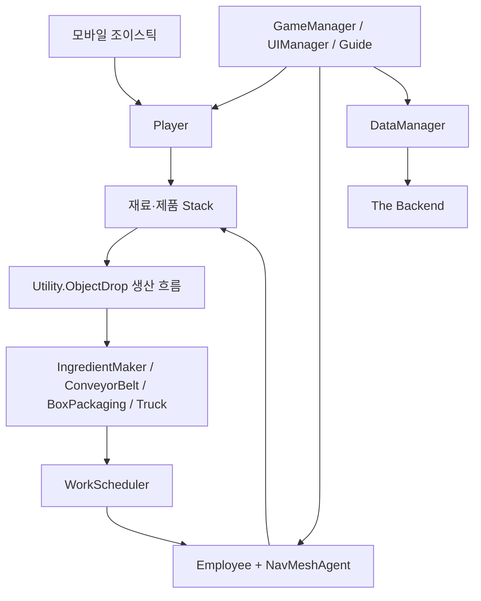

# 아키텍처

## 런타임 구성



## 작업 할당

`IStackable`은 기존 생산시설 계약을 유지하면서 순수 코어의 `IWorkTarget`을 상속합니다. Unity 객체와 Transform은 게임 계층에 남고, 선택과 예약 규칙만 `Churub.Core` 어셈블리로 분리됩니다.

1. 생산시설이 `GameManager.AddStackable`로 자신을 등록합니다.
2. 직원이 대기 상태에서 `TryReserveWork`를 요청합니다.
3. `WorkScheduler`가 예약되지 않은 대상 중 재고가 가장 많은 대상을 선택합니다.
4. 직원은 NavMesh로 픽업 위치까지 이동합니다.
5. 픽업, 비활성화 또는 작업 취소 시 예약을 해제합니다.

이 경계 덕분에 작업 선택 규칙은 Unity 씬이나 MonoBehaviour 없이 테스트할 수 있습니다.

## 데이터 흐름

기존 서비스 사용자와의 호환을 위해 백엔드 필드 이름은 유지합니다.

```text
BaseCost
├─ upgradeCosts
├─ playerData
├─ employeeList
├─ employeeData
├─ objectData
├─ gameProgressBool
├─ guideStep
└─ newGame
```

`DataManager.CreateGameDataParam`이 삽입과 갱신 요청의 공통 직렬화를 담당합니다. 데이터 생성은 최대 3회까지만 시도하여 네트워크 장애 시 무한 재귀를 방지합니다.

## 향후 경계

- `BaseCost`를 버전이 명시된 저장 DTO와 런타임 모델로 분리
- UI에서 Dictionary 문자열 키 직접 접근 제거
- 생산시설이 중앙 스케줄러에 작업 이벤트를 발행하도록 변경
- 직원 이동, 인벤토리, 표현을 별도 컴포넌트로 분리
- Google Play와 Backend SDK를 어댑터 뒤로 격리

