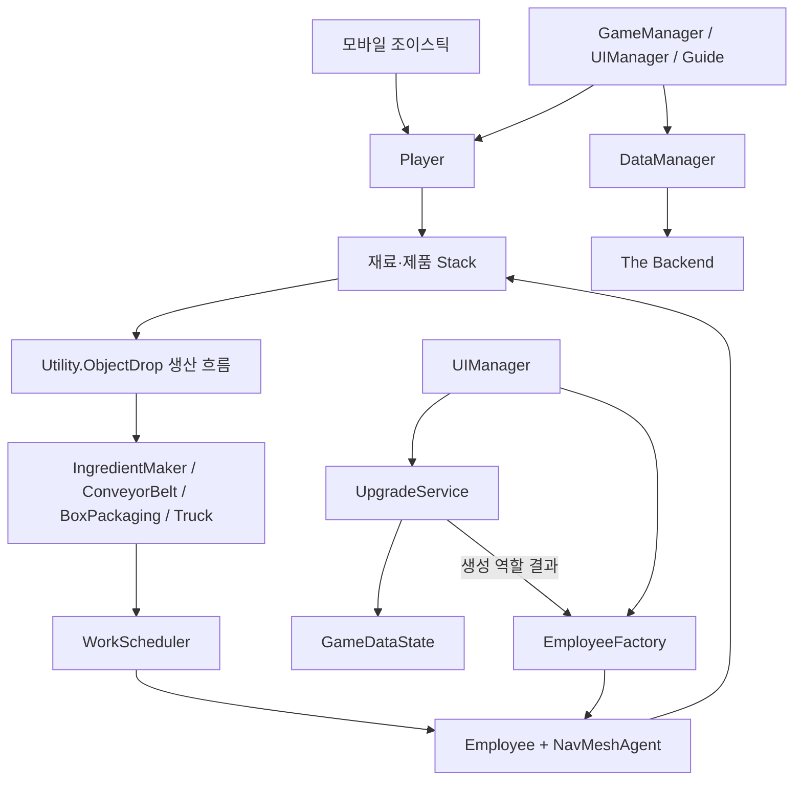

# 아키텍처

## 런타임 구성



## 작업 할당

`IStackable`은 기존 생산시설 계약을 유지하면서 순수 코어의 `IWorkTarget`을 상속합니다. Unity 객체와 Transform은 게임 계층에 남고, 선택과 예약 규칙만 `Churub.Core` 어셈블리로 분리됩니다.

1. 생산시설이 `GameManager.AddStackable`로 자신을 등록합니다.
2. 직원이 대기 상태에서 `TryReserveWork`를 요청합니다.
3. `WorkScheduler`가 예약되지 않은 대상 중 재고가 가장 많은 대상을 선택합니다.
4. 직원은 NavMesh로 픽업 위치까지 이동합니다.
5. 픽업, 비활성화 또는 작업 취소 시 예약을 해제합니다.

이 경계 덕분에 작업 선택 규칙은 Unity 씬이나 MonoBehaviour 없이 테스트할 수 있습니다.

## 데이터 흐름

기존 서비스 사용자와의 호환을 위해 백엔드 필드 이름은 유지합니다.

```text
GameDataState (BaseCost 호환 어댑터)
├─ upgradeCosts
├─ playerData
├─ employeeList
├─ employeeData
├─ objectData
├─ gameProgressBool
├─ guideStep
└─ newGame
```

`Churub.Core.GameDataState`가 런타임 상태와 출시 버전의 기본값을 소유합니다. 게임 코드는 `PlayerGold`, `EmployeeSpeed`, `TruckBoxCount`처럼 타입이 있는 속성을 사용하고, 기존 Dictionary는 백엔드 직렬화 경계에서만 접근합니다.

`UpgradeService`는 구매 가능 여부, 골드 차감, 단계·비용 증가, 플레이어와 직원 능력치 계산을 담당합니다. `EmployeeFactory`는 직원 프리팹 검증·선택·생성, 포장 담당 설정, 활성 직원 목록 등록을 담당합니다. `UIManager`는 버튼 입력을 서비스와 팩토리에 전달하고 결과, 사운드, 텍스트를 갱신합니다. 업그레이드 규칙은 Unity 없이 Core 테스트로 검증할 수 있습니다.

직원 구매 시 `UIManager`는 골드를 차감하기 전에 `EmployeeFactory.Validate` 결과를 확인합니다. 프리팹의 `Employee` 컴포넌트나 포장 배치 지점이 빠져 있으면 구매 상태를 변경하지 않고 UI에 오류를 표시합니다.

`GameDataSchema`가 테이블·필드·레거시 Dictionary 키를 한곳에서 관리합니다. `DataManager.CreateGameDataParam`은 이 상수를 사용해 삽입과 갱신 요청을 만들며, 서버의 `TestUserData` 테이블과 1.0.1 필드 이름은 변경하지 않습니다. 데이터 생성은 최대 3회까지만 시도하여 네트워크 장애 시 무한 재귀를 방지합니다.

기존 `BaseCost` 이름은 프리팹 및 레거시 코드 호환을 위한 얇은 어댑터로 유지하고 실제 구현은 `GameDataState`에 둡니다.

## 향후 경계

- 백엔드 응답 파싱을 버전이 명시된 저장 DTO로 분리
- 생산시설이 중앙 스케줄러에 작업 이벤트를 발행하도록 변경
- 직원 이동, 인벤토리, 표현을 별도 컴포넌트로 분리
- Google Play와 Backend SDK를 어댑터 뒤로 격리

